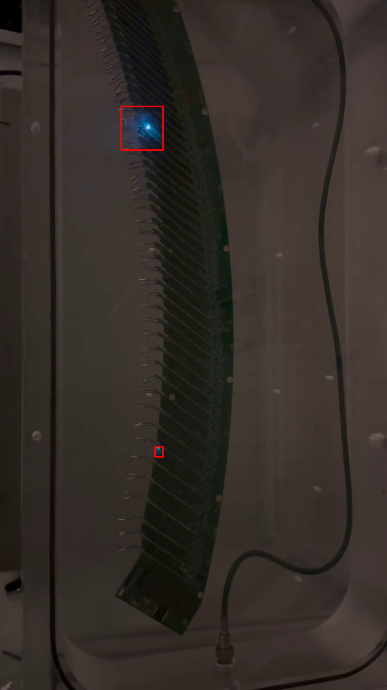

# mu2e-spark-detector

OpenCV vision processing software to detect sparks on AMB for the Mu2e experiment.

## Description

This software uses OpenCV vision processing in python in order to detect sparks given a specific masking threshold.

## Installation

To use this software, you need to install the required dependencies. You can do this by running:

```sh
pip install -r requirements.txt
```
## Usage

```sh
python detect_sparks.py <path_to_video_file>

```


Example: 
```sh
python detect_sparks.py demo/test_footage_air.mp4
```


